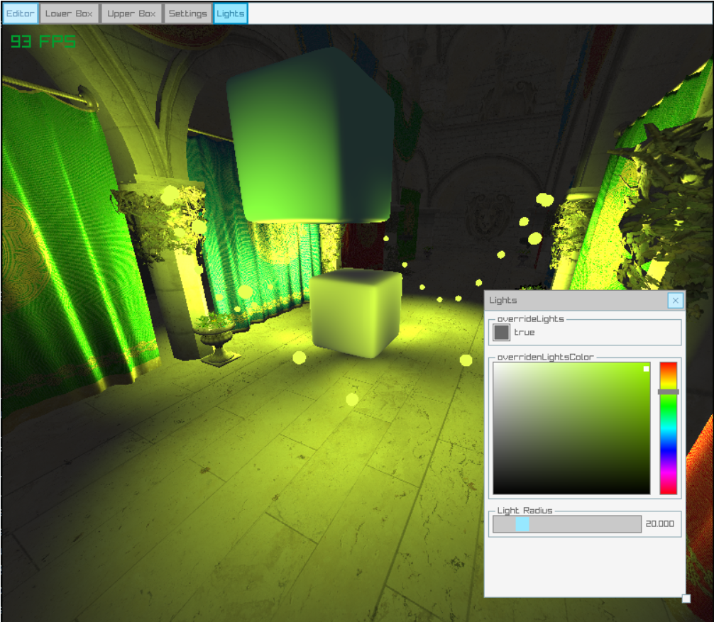
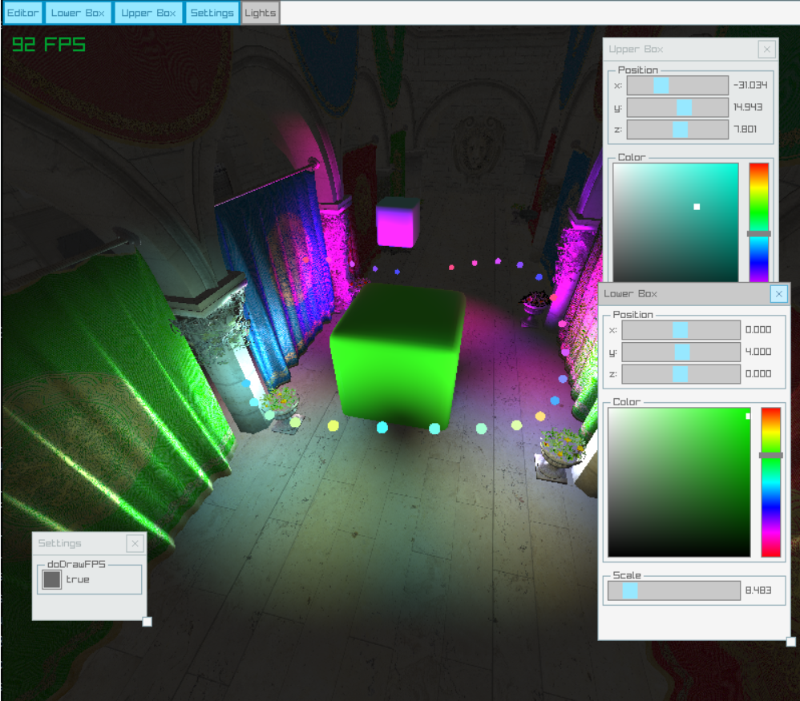

# About
Having fun with [raylib](https://www.raylib.com/examples.html) ([nimraylib_now bindings for nim](https://github.com/greenfork/nimraylib_now)). I have never felt so empowered to do computer graphics as with nim + raylib. It's really fun!

I also use my own editor "plugin" for nimraylib_now [nimraygui_editor](https://github.com/EriKWDev/nimraygui_editor) to edit variables and manage debug windows.

# Demo
- `<P>` to toggle release/capture of the mouse cursor
- `<F10>` to toggle Editor visibility
- Mouse scroll to zoom in out





To run the demo:
```sh
git clone git@github.com:EriKWDev/nimraylib_game_3d.git
cd nimraylib_game_3d
nimble run
```

# License
All code here is released under the MIT license. The model used here is the famous sponza scene from Crytek which (I beleive) is released under https://www.cryengine.com/ce-terms and used here under those terms. This is not a "serious game" and is only meant as a test of OpenGL.

Raylib is released under the zlib/libpng license by Ramon Santamaria (@raysan5) and some shader code has been copied and modified from raylib's examples for use in this demo.